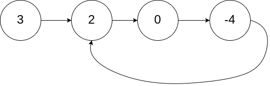

# LinkedList da tsikl bormi?
Berilgan LinkedList boshidan foydalanib unda tsikl borligini tekshiring.

``` 💡 LinkedList ni yurib chiqishda bir elementga qaytib duch kelsa, u yerda tsikl bor deyiladi.```

Misol 1:


Kiritish: [3,2,0,-4]
Natija: true
Misol 2:


Kiritish: [1,2]
Natija: true
Misol 2:


Kiritish: [1]
Natija: false
